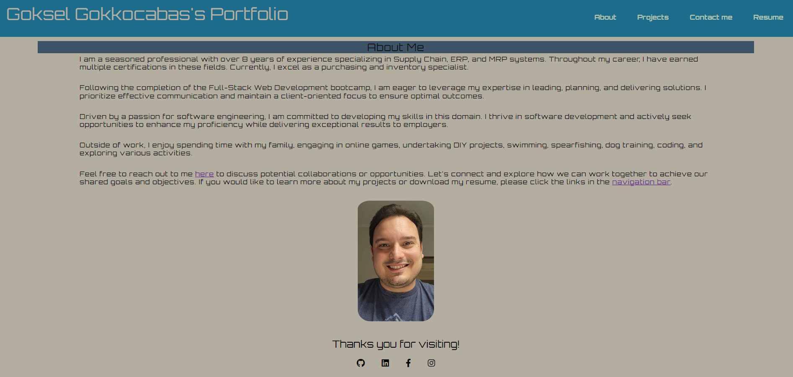
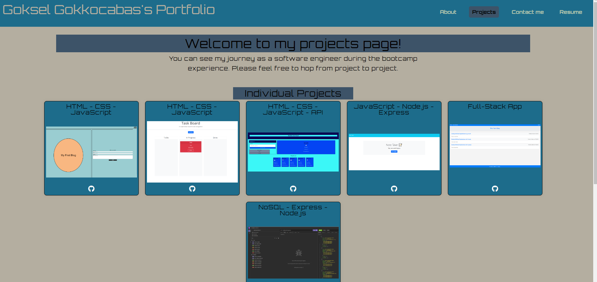
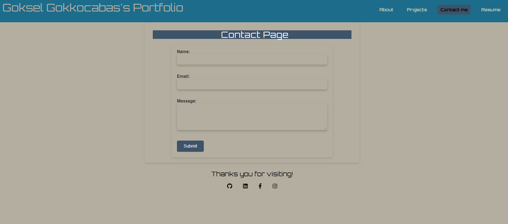
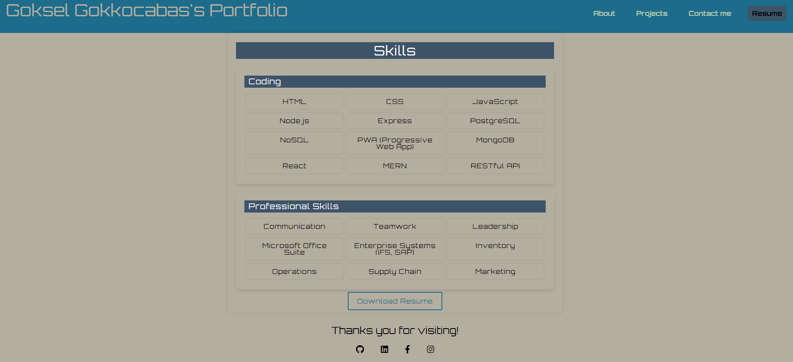

Title: Goksel Gokkocabas's Portfolio

Description:
In this challenge, I have created a web application that is powered by React.js. This application is my portfolio that includes an about me section, projects section, contact me section and resume section.
How to Run:
Please click on the deployed link in order to open the application. You can use the navigation tabs to learn about me by clicking the link "About", you can view my individual and group projects by clicking the link "Projects", you can send a message to me by clicking the link "Contact me", you can also view my skills and download my resume by clicking the link "Resume".

Github Repository : https://github.com/minikozort/Goksel-Gokkocabas-Portfolio.git
Deployed Link : 